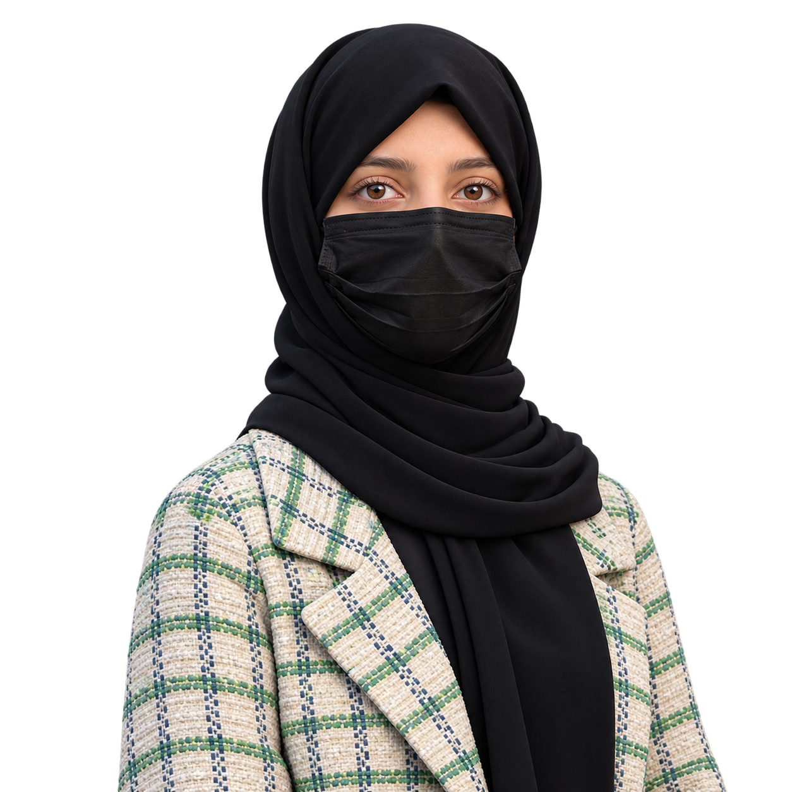

<table>
<tr>
<td width="38%" align="center" valign="middle">

</td>
<td width="62%" valign="middle">

<h1>WAJEEHA ASAD</h1>

<h3>AI ENGINEERING · FULL-STACK DEVELOPMENT · PRODUCT BUILDING</h3>

  
  
  

**Computer Science student · AI Engineering Intern · Product builder**

📍 Pakistan · 🤖 Applied AI & GenAI · ⚡ React + Python

<blockquote>
<em>Build it. Understand it. Make it better.</em>
</blockquote>

</td>
</tr>
</table>PROFILE`

I'm a Computer Science student who enjoys working across the AI and application stack: from experimenting with machine learning and LLM workflows to building the interfaces and APIs that make software useful.

Right now, I'm:
- **Growing as an AI engineer** through hands-on internship work and practical projects.
- **Building for real users**, including a client website for Flourish Well.
- **Exploring applied GenAI** through hackathon projects involving RAG, LLMs, and AI-assisted workflows.
- **Developing full-stack products** with React, Python, FastAPI, and databases.

> My goal: understand the system, build the product, test the assumptions, and ship something people can actually use.

## `02 / SELECTED BUILDS`

<table>
<tr>
<td width="50%" valign="top">

### ◈ NeuraTrack
**Full-stack learning & productivity platform**

A learning tracker with learning paths, focus sessions, analytics, streaks, achievements, and an AI companion.

**Built with:** React · FastAPI · Python · PostgreSQL · SQLAlchemy

[Repository ↗](https://github.com/wajeeha-asad/NeuraTrack) · [Live app ↗](https://neuratrack-app.vercel.app/)

</td>
<td width="50%" valign="top">

### ◈ Skill Gap Predictor
**Machine-learning application**

An application focused on identifying skill gaps and helping users understand areas for further learning.

**Built with:** Python · Machine Learning · Streamlit

[Repository ↗](https://github.com/wajeeha-asad/skill-gap-predictor) · [Live app ↗](https://skill-gap-predictor.vercel.app/)

</td>
</tr>
<tr>
<td width="50%" valign="top">

### ◈ CivicAgent PK
**GenAI hackathon project · Civic support**

A citizen-complaint assistant concept for Urdu/English use cases, combining policy retrieval with generated responses and official-style reporting.

**My contribution:** LLM integration, prompt work, and a ChromaDB-based policy retrieval workflow.

**Built with:** Python · Groq · Llama · ChromaDB · RAG

[My repository ↗](https://github.com/wajeeha-asad/CivicAgent-PK-wajeeha) · [Try the demo ↗](https://civicagent-pk-2ulotjmrihrrvjc9tzqyqm.streamlit.app/)

</td>
<td width="50%" valign="top">

### ◈ BrainX AI
**Agentic AI hackathon project · Medical AI concept**

An AI-assisted brain-tumor diagnostic copilot concept designed to explain MRI-based predictions in more understandable language and guide a patient-to-report workflow.

**My contribution:** frontend and UI implementation as part of a team.

[Team repository ↗](https://github.com/zaheer-ahmed77/BrainX-AI) · [Project site ↗](https://BrainXAI.zaheer.tech)

</td>
</tr>
<tr>
<td width="50%" valign="top">

### ◈ Flourish Well
**Real-client website · In progress**

A client website currently in development. This is a practical opportunity to work with real requirements, communicate around a brief, and deliver a usable web experience.

**Status:** In progress

[Repository ↗](https://github.com/wajeeha-asad/Flourish-Well-Website)

</td>
<td width="50%" valign="top">

### ◈ Student Performance Prediction
**Applied machine learning**

A small end-to-end ML project exploring student-performance prediction through an interactive app.

**Built with:** Python · Pandas · NumPy · scikit-learn · Streamlit

[Repository ↗](https://github.com/wajeeha-asad/student-performance-prediction) · [Live app ↗](https://ml-student-performance-prediction.streamlit.app/)

</td>
</tr>
</table>

<b>More frontend experiments</b> — click to expand

- **[Velora — Digital Atelier](https://github.com/wajeeha-asad/velora-digital-atelier)** — fashion e-commerce concept with a premium visual direction. [Live site ↗](https://velora-atelier-e-com.vercel.app/)
- **[Luxe & Latte](https://github.com/wajeeha-asad/Luxe-Latte-Premium-Coffee-Experience)** — coffee brand web experience focused on visual storytelling and responsive UI.

## `03 / TECH TOOLKIT`

  

| Area | Current toolkit |
|---|---|
| **Languages** | Python, JavaScript, C++ |
| **AI / ML** | scikit-learn, Pandas, NumPy, LLM APIs, prompt engineering, RAG fundamentals |
| **Backend & data** | FastAPI, REST APIs, PostgreSQL, SQLAlchemy, Supabase |
| **Frontend** | React, Vite, HTML, CSS, Tailwind CSS |
| **Workflow** | Git, GitHub, Streamlit, Vercel |

*Honest status: I'm still strengthening my Python and AI/ML fundamentals. The tools above reflect technologies I've used or am actively learning—not expert-level mastery of every item.*

## `04 / CURRENT CHAPTER`

- **Work:** AI Engineering Intern at Paandaaa
- **Building:** Flourish Well client website
- **Hackathons:** CivicAgent PK and BrainX AI
- **Learning:** practical LLM applications, RAG, model evaluation, and reliable API-backed products
- **Course:** completed the Pak Angels / ASPIRE Pakistan GenAI & Agentic AI course and its associated hackathon journey

## `05 / GITHUB TELEMETRY`

  
  

  

## `06 / CONNECT`

<a href="https://www.linkedin.com/in/wajeehaasad/">LinkedIn</a> ·
<a href="https://wajeehaasad-portfolio.vercel.app/">Portfolio</a> ·
<a href="https://github.com/wajeeha-asad">GitHub</a>

 

*Build it. Understand it. Make it better.*

